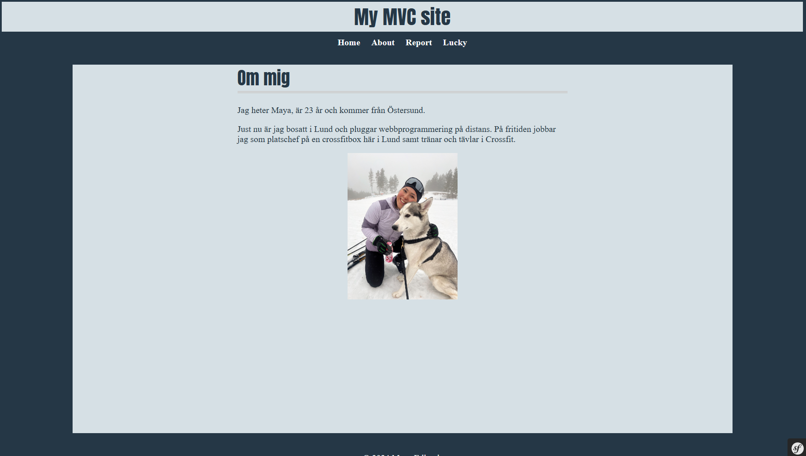

My report repo
=======================

## Komma igång

Följ dessa steg för att köra denna webbplats lokalt.

1. Klona repot
git clone https://github.com/mayaaedlund/mvcreport

2. Navigera till den klonade mappen
cd public

3. Installera npm
npm install

4. Starta egen server
<<<<<<< HEAD
php -S localhost:8888 -t public
=======
php -S localhost:8888 -t public
>>>>>>> 1eb15a7d2960499d64fccbaae8b7b15fccbf7553
